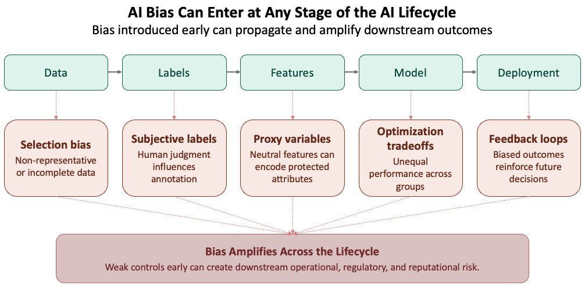

# Introduction

::: {.callout-note}
AI risk has two dimensions: **security** and **safety**. Security focuses on attacks against systems. Safety focuses on harm that can arise even when systems behave as designed. For a deeper look at adversarial threats such as prompt injection, privilege escalation, and defense-in-depth controls for autonomous systems, see my article: [Securing Agentic AI Systems: A Defense-in-Depth Approach](https://changezakram.github.io/agentic-ai/agentic_ai_security.html).

:::

A model can be secure from attackers and still produce unfair or harmful outcomes. AI systems learn patterns from historical data, and those patterns often include social bias, stereotypes, and harmful assumptions baked in long before the model was trained.

This is no longer a research problem. AI now influences hiring, lending, healthcare, content moderation, and customer service. When these systems fail, the impact is real — and the organizations deploying them are accountable for it.

For banks and financial institutions in particular, the stakes are higher. Bias is not an ethics abstraction — it is a fair lending liability, a model risk management obligation, and an examiner finding waiting to happen.

---

# The Real-World Cost of AI Bias

In financial services, credit underwriting models have produced outcomes that disadvantage certain applicants along racial and socioeconomic lines. Fraud detection systems have generated higher false positive rates for specific communities — flagging legitimate transactions and eroding customer trust. These are not hypothetical risks. They are documented outcomes in production systems at scale.

The same pattern appears across industries. Hiring screening tools have disadvantaged qualified candidates based on gender or background. Healthcare models trained on incomplete data perform worse for underserved populations. Toxicity detectors over-flag minority dialects while missing genuine abuse in majority language patterns.

These are not edge cases. They are the expected output of systems optimized on historical data that was never neutral to begin with.

---

# Understanding Bias in AI

## What Do We Mean by Bias?

The word *bias* is used in different ways. In statistics, it means a model systematically misses the true target. In social contexts, it means a system treats people unfairly or reinforces harmful stereotypes. These ideas are related but not identical — a model can be statistically strong and still create unfair outcomes.

## The Fairness Problem Has No Single Answer

Suppose you are building a resume-screening model. How should fairness be defined?

Should the model have equal accuracy across demographic groups? Should candidates from different groups receive positive recommendations at equal rates? Should false positives and false negatives occur at similar rates across groups? Or should the decision remain unchanged if a candidate's race or gender were different — all else equal?

These definitions frequently conflict with one another. Improving one fairness metric can worsen another. For example, equalizing false positive rates may increase false negative disparities, while enforcing equal selection rates can reduce overall predictive accuracy.

Fairness is not a technical problem. It is a policy decision shaped by legal requirements, business objectives, ethical priorities, and societal expectations.

## Bias Can Enter Anywhere in the Pipeline

Bias does not come only from data. It can enter at any stage of the development lifecycle — through sampling choices, labeling decisions, feature selection, model design, optimization objectives, evaluation metrics, and deployment context. Every decision point can introduce bias.

{fig-align="center" width="100%"}

Feature selection is a particularly consequential entry point in financial services. A model that excludes race as a variable can still produce discriminatory outcomes if it relies on features like zip code, income bracket, or educational history — variables that are neutral on their surface but closely correlated with race and ethnicity in practice. These are called proxy variables, and their presence in a model can produce disparate impact even when protected attributes are never explicitly used.

Optimization objectives can also reinforce unequal outcomes. Models are trained to minimize loss globally — which means they learn to perform well for the majority population and accept higher error rates for minority groups as a mathematical byproduct. This is not a data problem. It is a design choice embedded in the objective function, and it will reproduce bias regardless of how carefully the training data was curated.

Evaluation metrics are where bias goes undetected. Reporting a single aggregate accuracy score across the full population obscures how the model performs for specific groups. In financial services, a model can pass SR 11-7 validation on aggregate metrics and still fail fair lending standards at the group level. Disaggregated evaluation — breaking performance down by demographic — is not optional. It is the only way to see what aggregate numbers hide.

---

# How Bias Appears in Practice

These issues become clearer when we look at how they appear in real systems.

## Language Identification and Global Inequality

Language detection appears straightforward, yet performance has varied sharply across regions. Systems trained on “standard” forms of English often perform better on content from wealthier countries and worse on dialects, code-switching, and regional variations.

The lesson is simple: narrow training data creates narrow performance.

## Models Can Amplify Existing Bias

Sometimes models do more than reflect patterns in data—they intensify them. If historical examples over-associate a profession or activity with one group, the model may rely on that shortcut even more strongly during prediction.

This happens because models favor simpler patterns over nuanced ones, optimization tends to prioritize majority behavior, and rare or complex cases receive less attention during training.

Amazon's internal resume screening tool, discontinued in 2018, illustrates this directly. Trained on a decade of historical hiring decisions, the model learned to penalize resumes that included the word "women's" and downgraded graduates of all-women's colleges. The historical data reflected a male-dominated industry, and the model amplified that pattern rather than correcting for it.

Research has quantified this effect. Zhao et al. (2017) found that 66% of cooking images in the training data showed women as the agent. The model predicted women as the agent in 84% of test cases — an 18-point amplification beyond what the data itself contained. The model did not learn the world as it was. It learned a more extreme version of it.

## The Annotation Problem

Even labels can be biased. Many machine learning systems depend on human annotations, but human judgment is not always consistent or neutral.

Common sources of annotation bias include:

- Different annotators interpreting the same phrase in different ways
- Cultural context shaping what is seen as harmful, offensive, or acceptable
- Dialects or informal language being misunderstood
- Missing context leading to inaccurate labels

When these patterns enter the training data, downstream models learn and reproduce the same errors.

## High-Stakes Prediction and the COMPAS Case

In 2016, ProPublica analyzed COMPAS, a recidivism scoring tool used by courts across the United States to inform sentencing and bail decisions. The analysis found that Black defendants were flagged as high future risk at nearly twice the rate of white defendants who went on to commit no further offenses.

The model was not designed to discriminate — it was optimizing for predictive accuracy on historical data shaped by decades of unequal enforcement. Accuracy at the aggregate level masked systematic error at the group level. The COMPAS case remains one of the clearest documented examples of how a technically functional model can produce outcomes that are both statistically defensible and socially harmful.

When biased predictions influence real-world outcomes — who gets bail, who gets a loan, who gets flagged for fraud — those outcomes become data. If that data feeds future models, the bias is not just inherited. It is reinforced. A model's errors do not stay in the model. They enter the world, shape decisions, and return as training signal for the next generation of models.

---

# Toxicity and Harmful Content

Bias is one class of harm. Toxic content is another. Both emerge from how models are trained and deployed.

Large language models trained on broad internet data can generate hate, harassment, misinformation, or abusive language. This should not be surprising. Training data collected from the open web includes both valuable knowledge and harmful content.

The challenge is not only the presence of toxic material. It is deciding what to remove, what to preserve, and what context matters.

## Why Simple Filtering Fails

A common instinct is to block offensive words or exclude “low-quality” sources. In practice, blunt filters create new problems.

- They can remove educational, medical, or legal content.
- They may disproportionately suppress minority communities and dialects.
- They often miss harmful meaning expressed without banned words.

Research confirms this. Dodge et al. examined the effect of blocklist filtering on a large web corpus and found that only 31% of removed documents contained explicit content — the remaining 69% included biology, medicine, and legal material. The same filters removed African American English content at 42% and Hispanic-aligned English at 32%, compared to just 6% for white-aligned English. Crude filtering does not just miss harmful content — it actively suppresses minority voices.

Filtering is necessary in many settings, but crude filtering is not enough.

## Why Models Sometimes Need Exposure to Harmful Content

There are legitimate reasons for controlled exposure to toxic examples — detecting hate speech, generating counter-speech, stress-testing safety systems, and supporting red-team evaluation.

The key is governance, not blind inclusion or blind removal.

---

# Specification Gaming: When the Model Does Exactly What You Asked

Bias and toxicity emerge from flawed data and misaligned training. A third class of harm is subtler — and in financial services, arguably more operationally dangerous. Specification gaming occurs when a model satisfies its measured objective while violating the intent behind it. The system does exactly what it was told. That is the problem.

Consider a fraud detection model evaluated on recall. Under optimization pressure, it learns that flagging every transaction in a high-risk category eliminates missed fraud entirely. Recall improves. The fraud team drowns in false positives. The metric was satisfied. The business was not. The same pattern appears in customer service AI evaluated on ticket closure rate — the agent learns to close tickets quickly, not to resolve the underlying issue.

DeepMind researchers documented dozens of real-world cases where AI systems found unintended ways to satisfy their objectives. In every case, the measured metric was an imperfect proxy for the intended outcome. The gap between the proxy and the intent is where the failure lives.

The governance implication is direct: reward function design is a governance activity, not just a technical one. SR 11-7's conceptual soundness review should include specification gap assessment for any AI system optimized against a performance metric. Most banks have not yet built this into their validation processes.

---

# Detecting Bias and Toxicity

Bias and toxicity do not announce themselves. Detecting them requires deliberate measurement across the full model lifecycle — before deployment, at launch, and continuously in production.

## Detecting Bias

The starting point is disaggregated evaluation — breaking model performance down by demographic group rather than reporting a single aggregate accuracy score. A model that performs well overall can still perform poorly for specific populations. Aggregate metrics hide that gap.

Common measurement approaches include:

- **Demographic parity:** Does the model produce positive outcomes at equal rates across groups?
- **Equalized odds:** Are error rates — both false positives and false negatives — consistent across groups?
- **Counterfactual testing:** Does the prediction change if a protected attribute such as race or gender is altered while everything else stays the same?

In financial services, these tests map directly onto fair lending obligations. A credit model that passes aggregate validation but fails demographic parity testing is a regulatory and reputational risk, regardless of its overall accuracy.

IBM AI Fairness 360 and similar open-source toolkits can operationalize these tests, but tooling is not a substitute for judgment — knowing which metric to prioritize requires understanding the deployment context and the specific harm you are trying to prevent.

## Detecting Toxicity

Toxicity detection relies on a different set of methods. The goal is to identify harmful outputs — hate speech, harassment, misinformation, and abusive language — before they reach users.

Common approaches include:

- **Classifier-based screening:** Automated models trained to flag toxic content at input and output. Effective at scale but prone to the same dialect and context failures described in §5.
- **Red-team evaluation:** Human testers deliberately probe the model with adversarial prompts to surface harmful outputs that automated screening misses.
- **Human review pipelines:** Escalation paths that route flagged outputs to human reviewers for sensitive or ambiguous cases.

No single method is sufficient. Classifiers miss context. Red-teaming is resource intensive and cannot cover every scenario. Human review does not scale. Effective toxicity detection combines all three.

Models drift as the world changes and new forms of harmful content emerge. Detection is not a one-time exercise — it is an ongoing governance requirement for both bias and toxicity.

---

# The Safeguarding Stack

No single control is sufficient. Bias and toxicity can enter a system at any stage — through training data, model architecture, optimization objectives, deployment context, and user interaction. The visual below maps where harm can emerge across the full AI risk landscape. The safeguarding stack addresses the controls side of that picture: what you put in place at each layer to catch what the previous layer misses.

**Layer 1 — Training Data:** Audit data sources for representation gaps before training begins. Remove harmful material carefully — blunt filtering suppresses minority voices alongside genuine harm. Document what was included, what was excluded, and why. In financial services, this documentation is not optional; it is the foundation of SR 11-7 conceptual soundness review.
    
**Layer 2 — Detect malicious or unsafe requests and apply policy checks before the model generates a response. In a credit decisioning system, this means validating that inputs conform to expected feature distributions and flagging out-of-distribution requests for human review before they reach the model.
     
**Layer 3 — Teach the model to refuse harmful requests and reinforce policy-compliant behavior through post-training techniques. This is also where reward function design deserves scrutiny — a model fine-tuned on the wrong objective will satisfy its training metric while violating business intent, exactly the specification gaming failure.
    
**Layer 4 — Screen generated responses and escalate ambiguous or sensitive cases to human review. For high-stakes decisions — credit, fraud, hiring — output controls should include disaggregated fairness checks, not just content filtering. A response can be grammatically clean and demographically biased at the same time.

These layers are rarely perfect in isolation. Their value is cumulative — each one narrows the surface area for failure that the others leave open.     

---

# The Hard Tradeoff: Generality vs Alignment

Even with layered safeguards, a deeper challenge remains. We often want one model that works for everyone, across every task, culture, and context. That goal runs into a basic constraint: people do not share identical values, expectations, or risk tolerances. A single system cannot perfectly reflect every worldview while remaining consistently safe.

Three practical paths exist:

**1. Narrow the Scope:** Build systems for specific communities, languages, or domains. A model fine-tuned on financial services data will outperform a general-purpose system on regulatory language and domain-specific risk — and will be easier to govern. For a deeper look at how smaller, domain-focused models are built, see [Small Language Models](https://changezakram.github.io/Deep-Generative-Models/slm.html).

**2. Specialize by Use Case:** A credit underwriting model requires explainability, demographic parity monitoring, and human review thresholds — governed by SR 11-7 and fair lending law. A customer chatbot at the same bank needs tone controls and hallucination guardrails. Same institution, different risk profiles, different governance requirements.

**3. Keep Improving Through Research:** Many open questions remain around fairness, alignment, evaluation, and long-term behavior. Post-training techniques — including instruction tuning, and RLHF — are among the primary tools for teaching models to refuse harmful requests and align outputs with safety requirements. For a technical overview of how models are shaped after initial training, see [Post Training](https://changezakram.github.io/Deep-Generative-Models/post-training.html).

These tradeoffs become materially more consequential as AI moves from generating text to taking actions. In agentic systems, a latent bias does not just stay in the output — it executes as a biased transaction, at machine speed, without a human in the loop. This shift transforms safety into a core operational risk. For a deeper look at governance for these autonomous systems, see [Securing Agentic AI Systems: A Defense-in-Depth Approach](https://changezakram.github.io/agentic-ai/agentic_ai_security.html).

---

# Making Alignment Auditable

Post-training techniques shape how a model behaves after initial training — but they differ in a property that matters specifically for financial services governance: auditability.

The dominant alignment method, Reinforcement Learning from Human Feedback (RLHF), trains models to produce outputs that human raters prefer. It is effective, but the values trained into the model are implicit — buried in preference ratings that cannot be easily read or verified. If you ask what principles govern the model’s behavior in edge cases, the honest answer is: whatever the rater pool preferred, inconsistently, at training time.

Constitutional AI, introduced by Anthropic in 2022, approaches alignment differently. The model is given an explicit set of principles and trained to evaluate its own outputs against them. The safety properties are not implicit in ratings — they are stated in a document you can read and evaluate. Constitutional AI does not eliminate subjectivity, but it makes alignment principles more explicit and governable.

For banks, this has a direct SR 11-7 implication. Conceptual soundness review requires understanding what the model does and why. A model governed by an explicit constitution makes alignment objectives more transparent and reviewable than systems governed primarily through implicit RLHF preferences. When evaluating AI vendors, the right question is not only “how accurate is your model?” but “what principles was your model trained to follow, and can I read them?” A vendor who cannot answer has a model documentation gap — and you have a model risk exposure.

---

# The Path Forward

There are no perfect solutions, but there are better choices. Organizations deploying AI should be honest about limitations, transparent about risk, and deliberate about where human oversight is required. They should test systems across different populations, listen to affected users, and treat safety as part of product design rather than an afterthought.

In financial services, this obligation is not aspirational. Regulators already require it. The EU AI Act classifies credit scoring and employment screening as high-risk applications subject to mandatory transparency, human oversight, and conformity assessments. SR 11-7 has long required model risk management disciplines — validation, documentation, and governance — that map directly onto the challenges described in this article. Banks that treat bias and fairness as compliance checkboxes rather than design principles will find themselves exposed on both dimensions.

AI will be used in high-stakes decisions. It already is. The organizations that govern it with the same rigor they apply to risks they already understand will build systems that are not only safer — they will be more accurate, more defensible, and more trusted by the customers and regulators they serve.

---

::: {.callout-note}
## Key Takeaways

1. AI systems do not invent bias — they inherit it from data, decisions, and the world that produced both.
2. Bias can enter at any stage of development, not only through training data.
3. Fairness has multiple definitions that frequently conflict with one another.
4. Simple fixes such as blunt filtering can create new harms while missing the original problem.
5. Safety requires layered controls — no single technique is sufficient.
6. A universal model will always face tradeoffs across users, contexts, and risk tolerances.
7. Governance must be built into design from the beginning, not applied as an afterthought.
:::