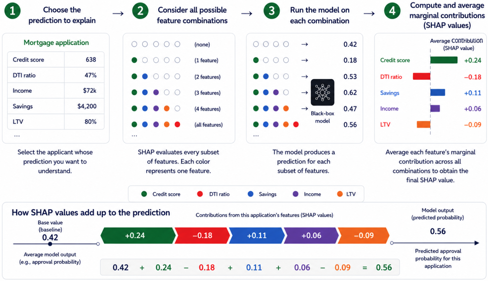

## Why Explainability Exists

Explainability is often treated as a technical add-on — something applied after a model is trained, when regulators or stakeholders begin asking how decisions were made. The reason it exists is simpler: optimization breaks down in the real world because objective functions cannot fully capture acceptable behavior.

The stakes are not abstract. Google’s facial recognition system once mislabeled Black individuals as gorillas. Unable to fix the underlying bias, Google removed primate-related labels entirely—a workaround, not a solution. Uber’s autonomous vehicle fatality raised questions about accountability in systems no one fully understands. As Cathy O’Neil documents in *Weapons of Math Destruction*, opaque models create feedback loops that amplify bias across criminal justice, hiring, credit scoring, and healthcare.

The presence of machine learning alone does not determine whether explainability matters. Context does.

---

## When Explainability Matters—and When It Does Not

Not every system needs explanations. When errors are reversible, harm is limited, and no human is expected to interpret or justify individual decisions, performance metrics are often sufficient. Recommendation systems, ad targeting, and internal optimization tools fall into this category. If a model makes a poor prediction, the consequences are contained.

High-stakes systems change the equation. In healthcare, lending, hiring, and judicial settings, model outputs shape outcomes that cannot be undone. People may lose access to credit, treatment, employment, or liberty. In these settings, humans remain responsible for the decisions the system supports.

That responsibility does not disappear because a model is involved. When people are expected to rely on a system and justify its decisions, explainability becomes a safety requirement—not a transparency exercise.

---

## Why Accuracy Alone Breaks Down

In high-impact settings, accuracy alone is a weak guarantee of acceptable behavior.

Many such applications are under-studied. Training data rarely reflects the conditions encountered after deployment. Distribution shift is common. Historical data often encodes bias. Feedback loops quietly distort outcomes over time. A model can appear accurate in validation and still fail for reasons metrics never reveal.

High-stakes systems also face requirements that extend beyond predictive performance. Fairness, non-discrimination, robustness, safety, and legal defensibility all matter. Increasingly, regulations mandate transparency or a right to explanation when automated systems influence consequential decisions.

These demands expose a deeper issue: many of the criteria we care about cannot be fully specified as optimization objectives. What it means for a model to behave acceptably is often contextual, contested, and dependent on the situation. Problem formulations are inherently incomplete — and incompleteness is not the same as uncertainty. Uncertainty can be quantified and managed; incompleteness cannot. When a criterion cannot be encoded, behavior must be observed and explained rather than optimized.

That is where explainability enters—not as proof that a model is correct, but as a diagnostic tool for evaluating behavior that optimization alone cannot guarantee.

---

## Explainability as Diagnostic Infrastructure

Explainability is best understood as diagnostic infrastructure—a way to examine how a system behaves when performance metrics fall short. By inspecting what a model relies on and how its predictions change across cases, we can surface failure modes that would otherwise remain hidden.

In vision systems, explanations reveal shortcut learning: models that appear accurate while relying on irrelevant background cues. In financial systems, they can expose reliance on prohibited or proxy attributes. In clinical settings, they help practitioners decide when to trust a recommendation and when to override it.

For people affected by automated decisions, the need is different. Feature importance alone is rarely useful. What matters is recourse—understanding what could realistically change an outcome.

Across these cases, the audience varies — and so do their needs. End users may need recourse: what would change the outcome. Decision-makers need trust calibration: when to rely on the model and when to override it. Regulators need auditability and evidence that models behave consistently and without prohibited bias. Researchers and engineers need debugging tools to identify failure modes before deployment.

The function of explainability is to support all of these needs with the right explanation for the right audience — making failures visible before they become systemic.

For a deeper look at the bias and fairness failures that make explainability necessary, see [AI Safety: Secure Systems Can Still Cause Harm](https://changezakram.github.io/responsible-ai/ai-safety.html).

---

## Two Paths to Model Understanding

The first path is to design models that are interpretable by construction. These models expose their logic directly, allowing humans to inspect how inputs lead to outputs. Rule-based models, risk scores, and generalized additive models fall into this category. When an inherently interpretable model achieves adequate performance, it should usually be preferred. There is no secondary explanation model, no approximation, and no uncertainty about whether the explanation truly reflects the model’s behavior.

But there is a trade-off. Simpler models often sacrifice performance. In domains like banking and insurance, interpretability may be required for every decision—yet true relationships in data are rarely linear. The most accurate models are often the hardest to interpret. This tension is why post-hoc explainability methods exist.

The second path is to explain models after the fact. When models are too complex, externally sourced, or already deployed, post-hoc explanations act as a bridge between a black-box system and its users. The question shifts from *how does the model work?* to *how can its behavior be described without misleading people?*

That distinction matters.

---

## Explanation as an Interface, Not a Property

Post-hoc explanations do not reveal a model’s internal reasoning. They approximate behavior from the outside.

An explanation method takes a trained model and produces a secondary artifact—feature attributions, rules, examples, or counterfactuals—that people can inspect. This artifact sits between the system and its stakeholders, translating complex computation into a usable form.

This means explanations help people use a model, not fully understand it.

For this interface to be useful, it must balance two competing goals: reflecting what the model actually does and remaining understandable to its audience. Improving one often degrades the other. There is no universal solution. Explainability is inherently audience-dependent.

---

## Local and Global Views

Local explanations focus on individual predictions. They answer: *why did the model make this decision here?* These are useful for debugging, investigating specific outcomes, and assessing whether individual decisions are defensible.

Global explanations summarize behavior across populations. They address: *what does the model generally rely on?* and *are certain groups systematically affected?* These views are essential for governance, auditing, and regulatory oversight.

Local explanations reveal failures. Global explanations contextualize them. Both are necessary. Neither is sufficient on its own.

---

## Core Post-Hoc Techniques

### LIME (Local Interpretable Model-agnostic Explanations)

LIME explains a prediction by fitting a simple, interpretable model around a single decision. Instead of trying to explain the full behavior of a complex model, it focuses only on the local region near the prediction being analyzed. Conceptually, think of it as drawing a straight line around one small section of a very complicated curve.

The method works by creating many randomly generated variations of the original input — in a credit decisioning system, this means sampling applicants with slightly different feature values around the original — and observing how the model's prediction changes. Those nearby examples are weighted by their similarity to the original input. LIME then fits a simple local model that approximates the behavior of the larger black-box system in that neighborhood.

The approach is flexible and model-agnostic, which made it one of the earliest widely adopted explainability techniques for complex machine learning systems. But the same flexibility introduces an important limitation: explanations can change depending on how the perturbations are generated. Small changes to the sampling process may produce noticeably different explanations for the same prediction.

For banking applications, that instability matters. Adverse action notices, fair lending reviews, and regulatory examinations require explanations that are consistent and defensible. LIME is often useful for exploratory analysis and rapid debugging, but it is less reliable as a primary explanation framework for formal model governance.

{#fig-LIME fig-alt="Five-step LIME explanation diagram for a denied mortgage application" fig-align="center" width="100%"}

### SHAP (SHapley Additive exPlanations)

SHAP assigns each feature a fair share of credit for a prediction using principles from cooperative game theory — the same mathematics used to fairly divide credit among players in a shared outcome. Unlike LIME, which approximates locally and can produce inconsistent results, SHAP derives its values from a mathematically principled framework that guarantees consistency across explanations.

SHAP supports both local explanations ("Why was this applicant declined?") and global analysis ("What features drive decisions across the portfolio?"). That dual capability makes it the most defensible explainability approach for SR 11-7 model documentation and governance review.

The tradeoff is computational cost. SHAP evaluates every possible feature combination to estimate contributions fairly, which can become expensive at scale. That matters for real-time fraud detection and other latency-sensitive systems, but less so for underwriting and portfolio analytics, where decisions are not instantaneous. A further limitation worth noting: standard SHAP implementations assume features are independent when estimating contributions. In banking data where features are often correlated — credit score and income, for example — this assumption can assign attribution to unrealistic feature combinations, slightly distorting individual explanations.

{#fig-SHAP fig-alt="Four-step SHAP explanation diagram showing feature contributions for a mortgage application" fig-align="center" width="100%"}

The table below summarizes the key differences for practitioners deciding which technique fits their governance context.

| | LIME | SHAP |
|---|---|---|
| Scope | Local only | Local and global |
| Stability | Unstable | Stable |
| Computational cost | Fast | Computationally expensive at scale |
| Mathematical guarantees | None | Yes |
| SR 11-7 defensibility | Limited | Strong |
| Primary use case | Debugging | Formal governance |

*Table 1: LIME is useful for rapid local debugging, while SHAP is generally more defensible for formal model governance because it provides more stable, mathematically grounded explanations.*

### Counterfactual Explanations

Counterfactual explanations shift the question from "Why was this decision made?" to "What would need to change for the outcome to be different?" Wachter, Mittelstadt, and Russell (2017) proposed the approach as a way to support regulatory compliance and meaningful individual recourse — making it especially relevant for adverse action notices under ECOA and broader fair lending obligations.

A counterfactual explanation tells an applicant not just that income influenced the decision, but that increasing income by a specific amount would have changed the outcome. The practical challenge is generating realistic counterfactuals: mathematically minimal changes are often not actionable. Telling an applicant to earn $5,000 more is useful; telling them to build three more years of credit history is not.

At the portfolio level, counterfactual analysis becomes a governance tool: it can reveal whether some groups consistently need greater changes to achieve favorable outcomes. That pattern, if consistent, may indicate disparate impact — and a counterfactual audit can surface it before an examiner does.

{#fig-counterfactual fig-align="center" width="100%"}

### Permutation Feature Importance

Permutation importance measures how much a model depends on each feature across the full dataset. The method works by shuffling one feature at a time and observing how much model performance deteriorates. If performance drops significantly, the model was relying on that feature. If performance barely changes, the feature contributed little to the model’s predictions.

Unlike SHAP or counterfactual explanations, permutation importance is a global technique: it does not explain individual decisions, but instead reveals what drives the model overall. In financial services, permutation importance is a practical validation tool for conceptual soundness review. During model validation, it can help confirm that the features driving predictions make business sense and are not acting as hidden proxies for protected characteristics.

Its primary limitation is feature correlation. Correlated variables can dilute each other’s measured importance because the model can often substitute one for another. As a result, a genuinely important feature may appear less influential than it is.

---

## Attention Is Not Explanation

As large language models enter production, attention mechanisms — the internal weights that determine which inputs a model focuses on when generating a response — are often presented as explanations. This is a mistake.

Attention weights show which inputs influenced a prediction, not how or why a decision was made. High attention does not imply importance; low attention does not imply irrelevance. Treating attention as explanation conflates correlation with justification.

The same caution applies to saliency maps in vision models. Saliency shows where the model is sensitive, not why. Without context, these artifacts can create confidence without understanding.

---

## The Security Dimension

Explainability is also a security concern—one often overlooked.

Opaque models create attack surfaces. Model inversion attacks extract sensitive training data. Adversarial inputs exploit blind spots. Model drift quietly degrades performance as environments change.

Explainability can help detect these risks early. But it also introduces a paradox: revealing too much can create exploitation roadmaps. Organizations must balance transparency with security—providing enough insight to build trust without enabling abuse.

For a comprehensive treatment of adversarial threats and defense-in-depth controls for autonomous systems, see [Securing Agentic AI Systems: A Defense-in-Depth Approach](https://changezakram.github.io/agentic-ai/agentic_ai_security.html).

---

## The Limits of Post-Hoc Explainability

Post-hoc explanations are powerful tools, but they introduce new risks.

They can be unstable, misleading, or selectively presented. Most importantly, they can create the illusion that a system is understood when it is not.

Explainability does not make a system fair, safe, or free from human responsibility. Sometimes explanations reveal problems that require changing the model — or reconsidering whether it should have been deployed at all. 

Regulators are beginning to formalize these expectations.

---

## The Regulatory Reality

Regulation is not theoretical. Explainability requirements are already in force.

The EU AI Act mandates transparency for high-risk systems. GDPR grants individuals rights related to automated decisions. California's Transparency in Frontier AI Act requires disclosure of risks and mitigation measures.

In the United States, SR 11-7 model risk management guidance requires banks to demonstrate conceptual soundness and ongoing monitoring for models used in consequential decisions. For credit, fraud, and fair lending applications, explainability is not optional — it is the mechanism through which model governance becomes defensible to examiners.

Organizations deploying AI without explainability capabilities are accumulating regulatory debt that will eventually come due.

---

## A Practical View

Explainable AI is not about choosing the "right" technique. It is about judgment.

Interpretable models offer clarity but may lack flexibility. Post-hoc explanations make black-box models more inspectable, though the explanations themselves are approximations, not ground truth. None provides a complete picture.

Responsible AI does not require perfect transparency. It requires knowing when explanations are sufficient, when they mislead, and when a system should not be trusted at all.

Consider a credit decisioning model that achieves high accuracy but relies heavily on zip code — a well-documented proxy for race and national origin in fair lending contexts. A post-hoc explanation surfaces this reliance. The decision that follows is organizational, not technical. Explainability creates the conditions for that judgment. It does not substitute for it.

---

## Implications for Agentic Systems

For agentic AI—systems that act autonomously—the stakes rise further.

Agents do not just make predictions; they chain decisions, interact with environments, and adapt over time. Explaining a single output is hard enough. Explaining sequences of autonomous actions requires new approaches to traceability, accountability, and oversight.

The question is not whether to invest in explainability — it is whether to build it in now or retrofit it under pressure. Agentic systems that cannot account for their own behavior will not satisfy examiners, will not earn the trust of decision-makers, and will not survive the scrutiny that follows consequential failures. Explainability is not a feature to be added later. For autonomous systems operating in high-stakes environments, it is a precondition for deployment.

For a governance framework for these autonomous systems, see [Securing Agentic AI Systems: A Defense-in-Depth Approach](https://changezakram.github.io/agentic-ai/agentic_ai_security.html).

---

## Further Reading

[1] Molnar, Christoph. *Interpretable Machine Learning*. https://christophm.github.io/interpretable-ml-book/

[2] O’Neil, Cathy. *Weapons of Math Destruction*.

[3] Rudin, Cynthia. (2019). “Stop Explaining Black Box Machine Learning Models for High Stakes Decisions and Use Interpretable Models Instead.” https://arxiv.org/pdf/1811.10154

[4] Ribeiro, Singh, Guestrin. (2016) “Why Should I Trust You? Explaining the Predictions of Any Classifier.” https://arxiv.org/pdf/1602.04938

[5] Lundberg, Lee. (2017) “A Unified Approach to Interpreting Model Predictions.” https://arxiv.org/pdf/1705.07874

[6] Wachter, S., Mittelstadt, B., & Russell, C. (2017) "Counterfactual Explanations Without Opening the Black Box: Automated Decisions and the GDPR." https://arxiv.org/abs/1711.00399

[7] Breiman, L. "Random Forests." (2001) https://link.springer.com/article/10.1023/A:1010933404324

[8] Fisher, A., Rudin, C., & Dominici, F. (2019) "All Models are Wrong, but Many are Useful." https://arxiv.org/abs/1801.01489

[9] Joshi, P. et al. (2020) "The State and Fate of Linguistic Diversity and Inclusion in the NLP World." https://arxiv.org/abs/2004.09095

[10] Doshi-Velez, F., & Kim, B. (2017). Towards a Rigorous Science of Interpretable Machine Learning. https://arxiv.org/abs/1702.08608
